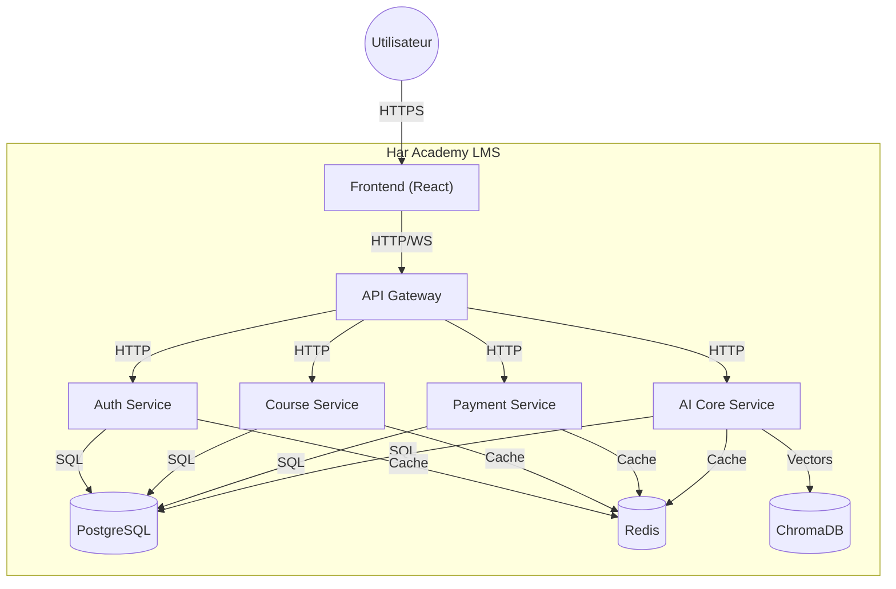

# Architecture de Har Academy

## Vue d'Ensemble

Har Academy est une plateforme d'apprentissage en ligne construite avec une architecture microservices. Cette architecture permet une scalabilité optimale, une maintenance facilitée et une évolution indépendante de chaque service.

## Architecture Système (C4 Level 1)



## Architecture Container (C4 Level 2)

### Frontend (React/TypeScript)
- **Port**: 3000
- **Responsabilités**:
  - Interface utilisateur responsive
  - Gestion d'état avec Redux/Context
  - Internationalisation (i18n)
  - Routing client
  - WebSocket pour notifications temps réel
  - Authentification côté client

### API Gateway (Node.js/Express)
- **Port**: 8000
- **Responsabilités**:
  - Routage des requêtes vers les microservices
  - Authentification centralisée
  - Rate limiting
  - Load balancing
  - Logging centralisé
  - CORS
  - Gestion des erreurs

### Auth Service (Node.js/Express)
- **Port**: 3001
- **Responsabilités**:
  - Inscription/Connexion utilisateurs
  - JWT management
  - Gestion des rôles (RBAC)
  - OAuth2 (optionnel)
  - Gestion profils utilisateurs
  - Sécurité/Validation

### Course Service (Node.js/Express)
- **Port**: 3002
- **Responsabilités**:
  - CRUD des cours
  - Gestion modules/leçons
  - Progression apprenants
  - Catalogue et filtrage
  - Statistiques d'apprentissage
  - Gestion des ressources

### Payment Service (Node.js/Express)
- **Port**: 3003
- **Responsabilités**:
  - Intégration Stripe
  - Gestion transactions
  - Abonnements
  - Webhooks
  - Factures
  - Remboursements

### AI Core Service (Python/FastAPI)
- **Port**: 5000
- **Responsabilités**:
  - Recommandations personnalisées
  - Génération de quiz
  - Chatbot pédagogique
  - RAG avec ChromaDB
  - Analyse des performances

## Architecture Base de Données

### MongoDB (Base principale)
- **Ports**:
  - Auth: 27019 (mongodb-auth)
  - Courses: 27017 (mongodb-courses)
  - Payments: 27018 (mongodb-payments)
- **Databases**:
  - har_auth
  - har_courses
  - har_payments
- **Collections principales**:
  ```javascript
  // Auth Service (Database: har_auth)
  users {
    _id: ObjectId,
    email: String (unique, lowercase),
    password_hash: String,
    first_name: String,
    last_name: String,
    avatar_url: String,
    role: Enum ['learner', 'instructor', 'admin'],
    status: Enum ['active', 'suspended', 'deleted'],
    language: String,
    created_at: ISODate,
    updated_at: ISODate,
    last_login_at: ISODate,
    instructor_info: {
      bio: String,
      expertise_tags: [String],
      total_courses: Number,
      rating: Number,
      verification_status: Enum ['unverified', 'verified', 'rejected']
    },
    notification_settings: {
      email_notifications: Boolean,
      marketing_emails: Boolean,
      newsletter: Boolean
    }
  }

  // Course Service (Database: har_courses)
  courses {
    _id: ObjectId,
    title: String,
    description: String,
    short_description: String,
    domain: Enum ['Excel', 'R', 'Python', 'Other'],
    stack: [String],
    price: {
      amount: Number,
      currency: String,
      pricing_model: Enum ['one-time', 'subscription']
    },
    instructor_id: ObjectId,
    instructor_name: String,
    status: Enum ['draft', 'published', 'archived'],
    modules: [ObjectId],
    total_lessons: Number,
    total_duration_hours: Number,
    enrollments_count: Number,
    average_rating: Number,
    reviews_count: Number,
    keywords: [String],
    image_url: String,
    category: String,
    language: String,
    created_at: ISODate,
    updated_at: ISODate,
    published_at: ISODate
  }

  modules {
    _id: ObjectId,
    course_id: ObjectId,
    title: String,
    description: String,
    order: Number,
    lessons: [ObjectId],
    created_at: ISODate
  }

  lessons {
    _id: ObjectId,
    module_id: ObjectId,
    course_id: ObjectId,
    title: String,
    description: String,
    type: Enum ['video', 'text', 'quiz', 'exercise'],
    order: Number,
    video: {
      url: String,
      duration_seconds: Number,
      transcript: String,
      thumbnail_url: String
    },
    content: String,
    quiz_id: ObjectId,
    created_at: ISODate,
    updated_at: ISODate
  }

  enrollments {
    _id: ObjectId,
    user_id: ObjectId,
    course_id: ObjectId,
    status: Enum ['active', 'completed', 'dropped'],
    progress_percentage: Number,
    completed_lessons: [ObjectId],
    last_accessed_lesson_id: ObjectId,
    enrolled_at: ISODate,
    completed_at: ISODate,
    last_accessed_at: ISODate
  }

  lesson_progress {
    _id: ObjectId,
    user_id: ObjectId,
    lesson_id: ObjectId,
    course_id: ObjectId,
    status: Enum ['not_started', 'in_progress', 'completed'],
    time_spent_seconds: Number,
    quiz_score: Number,
    created_at: ISODate,
    updated_at: ISODate
  }

  // Payment Service (Database: har_payments)
  transactions {
    _id: ObjectId,
    user_id: ObjectId,
    course_id: ObjectId,
    amount: Number,
    currency: String,
    status: Enum ['pending', 'completed', 'failed', 'refunded'],
    payment_method: Enum ['card', 'bank_transfer', 'free'],
    stripe_payment_intent_id: String,
    created_at: ISODate,
    completed_at: ISODate,
    refunded_at: ISODate
  }

  subscriptions {
    _id: ObjectId,
    user_id: ObjectId,
    plan: Enum ['basic', 'pro', 'enterprise'],
    status: Enum ['active', 'paused', 'cancelled', 'expired'],
    amount_per_month: Number,
    currency: String,
    renewal_date: ISODate,
    cancelled_date: ISODate,
    created_at: ISODate
  }
  ```

### Redis (Cache)
- **Port**: 6379
- **Usage**:
  - Sessions
  - Rate limiting
  - Cache de requêtes fréquentes
  - Données temporaires
  - File d'attente de tâches

### ChromaDB (Base vectorielle)
- **Usage**:
  - Stockage d'embeddings
  - Recherche sémantique
  - RAG pour chatbot
  - Indexation contenu cours

## Communication Inter-Services

### Synchrone (REST)
- Format: JSON
- Base URL: `/api/v1`
- Authentication: JWT Bearer token
- Rate Limiting: Oui
- Timeout: 30s

### Asynchrone (WebSocket)
- Format: JSON
- Events:
  - Notifications
  - Mises à jour temps réel
  - Chat

## Sécurité

### Authentification
- JWT (HS256/RS256)
- Refresh tokens
- Sessions Redis
- Rate limiting

### Autorisation
- RBAC (Role-Based Access Control)
- Middleware par service
- Validation JWT centralisée

### Données
- Chiffrement en transit (HTTPS)
- Hachage des mots de passe (bcrypt)
- Validation des entrées
- Protection CSRF

## Performance

### Caching
- Redis pour données fréquemment accédées
- Cache des requêtes API
- Cache des calculs coûteux

### Optimisation
- Pagination
- Indexation BD
- Compression
- CDN pour assets statiques

## Monitoring

### Métriques
- Temps de réponse
- Taux d'erreur
- Utilisation ressources
- Santé services

### Logging
- Centralisé
- Structuré (JSON)
- Niveaux (INFO, WARN, ERROR)
- Traçabilité (request_id)

## Déploiement

### Local (Docker Compose)
- 7 containers
- Volumes persistants
- Hot-reload
- Network isolation

### Production (Futur)
- Kubernetes
- Cloud-native
- Auto-scaling
- High availability

## Évolution Future

### Court terme
- Monitoring (Prometheus/Grafana)
- CI/CD (GitHub Actions)
- Documentation API (OpenAPI)
- Tests E2E

### Long terme
- Service mesh
- Microservices additionnels
- Réplication BD
- CDN global